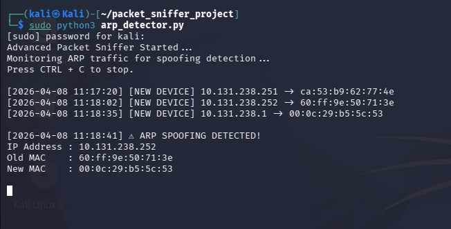
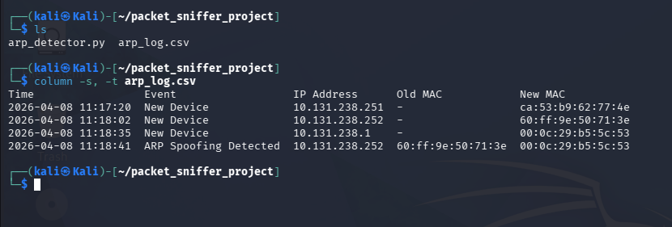

# Advanced Packet Sniffer + ARP Spoofing Detector

## Project Description
This project is a Python-based network security tool that captures and analyzes network packets in real time. It detects ARP spoofing attacks by monitoring changes in IP-MAC address mappings.

## Objectives
- Capture ARP packets from network traffic
- Monitor IP-MAC address mapping
- Detect ARP spoofing attacks
- Generate real-time alerts
- Log detected events

## Features
- Real-time packet sniffing
- ARP packet filtering
- IP-MAC mapping system
- ARP spoofing detection
- Alert system
- CSV logging
- Timestamp tracking

## Technologies Used
- Python
- Scapy
- Kali Linux

## How It Works
1. Captures network packets
2. Filters ARP packets
3. Extracts IP and MAC addresses
4. Stores IP-MAC mapping
5. Detects changes in mapping
6. Generates alert if spoofing is detected
7. Logs events into CSV file

## Installation
```bash
sudo apt update
sudo apt install python3-scapy
pip install -r requirements.txt
```

## How to Run
```bash
sudo python3 arp_detector.py
```

## Output
- Displays real-time alerts in terminal
- Logs detected events in `arp_log.csv`

## Sample Output



## Ethical Considerations
This project was tested in a controlled environment. Unauthorized network monitoring without permission may be illegal.

## Conclusion
This project demonstrates ARP spoofing detection using packet sniffing techniques. It improves accuracy with alerts, logging, and monitoring.

## Project Structure

```text
packet_sniffer_project/
|-- arp_detector.py
|-- arp_log.csv
|-- arp_detection_output.png
|-- arp_log_output.png
|-- Advanced_Packet_Sniffer_ARP_Spoofing_Detector_Project_Report.pdf
|-- requirements.txt
`-- README.md
```

## Author
Samyak Bhaisare
